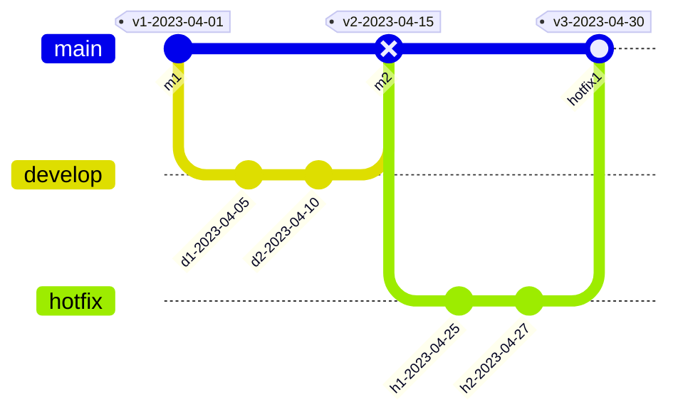

# four-keys

measure four keys metrics.

$$
DeploymentFrequency = (NumOfSuccessfulReleases) / (NumOfDays)
$$

$$
LeadTimeForChanges = mean( (ReleaseDateTime) - (DateTimeOfFirstCommitAfterPreviousRelease) )
$$

$$
TimeToRestore = mean( (RestoredReleaseDateTime) - (FailureReleaseDateTime) )
$$

$$
ChangeFailureRate = (NumOfFailureRelease) / (NumOfReleases)
$$

More detail for japanese: [Qiita](https://qiita.com/hmiyado/items/fb9b0409ab479942ad4c)

## Install

Download binary from [Releases page](https://github.com/hmiyado/four-keys/releases).

## Example

### Default

four-keys command outputs four keys by default.

```sh
$ four-keys | jq
{
  "option": {
    "since": "2022-06-18T20:41:47.377195+09:00",
    "until": "2022-07-18T20:41:47.377196+09:00"
  },
  "deploymentFrequency": 0.1,
  "leadTimeForChanges": {
    "value": 5.447465277777778,
    "unit": "day"
  },
  "timeToRestore": {
    "value": 0,
    "unit": "day"
  },
  "changeFailureRate": 0
}
```

### Time series

"timeSeries" option outputs four keys for each interval(day, week, month).

```sh
$ four-keys timeSeries --repository https://github.com/hmiyado/four-keys --since 2022-10-01 --until 2022-12-31 --interval month |jq
{
  "option": {
    "since": "2022-10-01T00:00:00Z",
    "until": "2022-12-31T23:59:59Z"
  },
  "items": [
    {
      "time": "2022-12-01T00:00:00Z",
      "deploymentFrequency": 0,
      "leadTimeForChanges": 0,
      "timeToRestore": 0,
      "changeFailureRate": 0
    },
    {
      "time": "2022-11-01T00:00:00Z",
      "deploymentFrequency": 1,
      "leadTimeForChanges": 12.61,
      "timeToRestore": 0,
      "changeFailureRate": 0
    },
    {
      "time": "2022-10-01T00:00:00Z",
      "deploymentFrequency": 3,
      "leadTimeForChanges": 20.960555555555555,
      "timeToRestore": 0,
      "changeFailureRate": 0
    }
  ]
}
```

### Releases

"releases" option outputs each releases used for calculating four keys.

```sh
$ four-keys releases --repository https://github.com/go-git/go-git --since 2015-12-20 --until 2016-01-12 | jq
{
  "option": {
    "since": "2015-12-20T00:00:00Z",
    "until": "2016-01-12T23:59:59Z"
  },
  "releases": [
    {
      "tag": "v2.1.2",
      "date": "2016-01-11T12:09:15+01:00",
      "leadTimeForChanges": {
        "value": 0.017638888888888888,
        "unit": "day"
      },
      "result": {
        "isSuccess": true,
        "timeToRestore": {
          "value": 2.7969791666666666,
          "unit": "day"
        }
      }
    },
    {
      "tag": "v2.1.1",
      "date": "2016-01-08T17:01:36+01:00",
      "leadTimeForChanges": {
        "value": 0.00863425925925926,
        "unit": "day"
      },
      "result": {
        "isSuccess": false,
        "timeToRestore": null
      }
    },
    {
      "tag": "v2.1.0",
      "date": "2015-12-23T09:48:11+01:00",
      "leadTimeForChanges": {
        "value": 6.587986111111111,
        "unit": "day"
      },
      "result": {
        "isSuccess": true,
        "timeToRestore": null
      }
    }
  ]
}
```

## Details of metrics



Assume above case, there are two successful releases and one failure release.

- version "v1-2023-04-01" was successfully released
- version "v2-2023-04-15" was released but it was failure
  - $$LeadTeimeForChanges = 2023{\text -}04{\text -}15 - 2023{\text -}04{\text -}05 = 10$$
- version "v3-2023-04-30" hotfixed "v2" and successfully released
  - $$LeadTeimeForChanges = 2023{\text -}04{\text -}30 - 2023{\text -}04{\text -}25 = 5$$

In this case, four keys in 2023-04(30 days) becomes below.

$$DeploymentFrequency = 2 / 30 = 0.067 $$

$$LeadTimeForChanges = mean((leadTime_{v2}), (leadTime_{v3})) = (10 + 5)/2 = 7.5 $$

$$TimeToRestore = mean(timeToRestore_{v2v3}) = ((2023{\text -}04{\text -}30 - 2023{\text -}04{\text -}15))/1 = 15$$

$$ChangeFailureRate = 1 / 3 = 0.33 $$

## License

see [LICENSE](./LICENSE)
